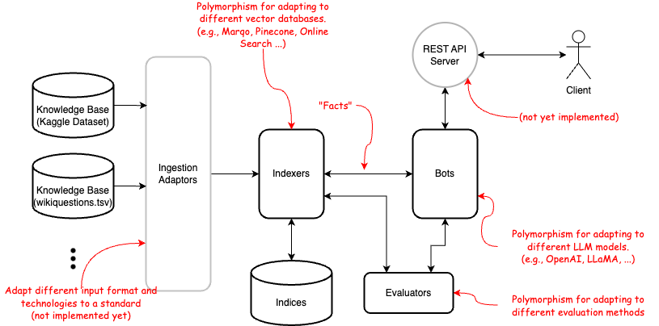

# Knowledge Q&A

Allowing one to ask a bot questions.
The bot can answer with its pretrained knowledge,
update the pretrained knowledge with supplemental knowledge updates,
or solely from within the scope of the given knowledge. 

## Project Structure

- **notebooks**: Contains Jupyter notebooks for experimentation
- **src/main**: Contains the code
  - **utilities**: Useful utilities copied from my other projects
    - **llm**: Wrappers around LLM model accesses
    - **embedding**: Wrappers around text embedding packages
  - **knowldgeqa**: Contains code for this assignment
    - **api**: REST API access
    - **bots**: Chatbots that answer questions
    - **indexer**: Indexing the known knowledge for the chatbot to retrieve
    - **evaluators**: Contains Evaluators that evaluate the performance of the bots

- **src/test**: Contains the tests for the code
- **data**: Contains test data
- **deployment**: Contains scripts for deployment

## Demo Notebooks

- **demo_basic**: Demonstrate basic functionality of the bot.  
- **demo_evaluator**: Demonstrate the "evaluators" that evaluate the performance of the bots.

## Architecture

## To-Dos

Stuff not yet implemented:
- REST API
- Chunking long articles.
- Make the bot ask followup questions if it does not know the answer.
- Deployment helpers.
